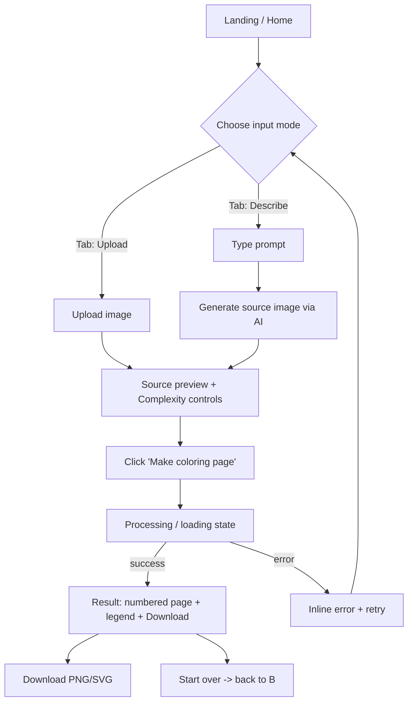
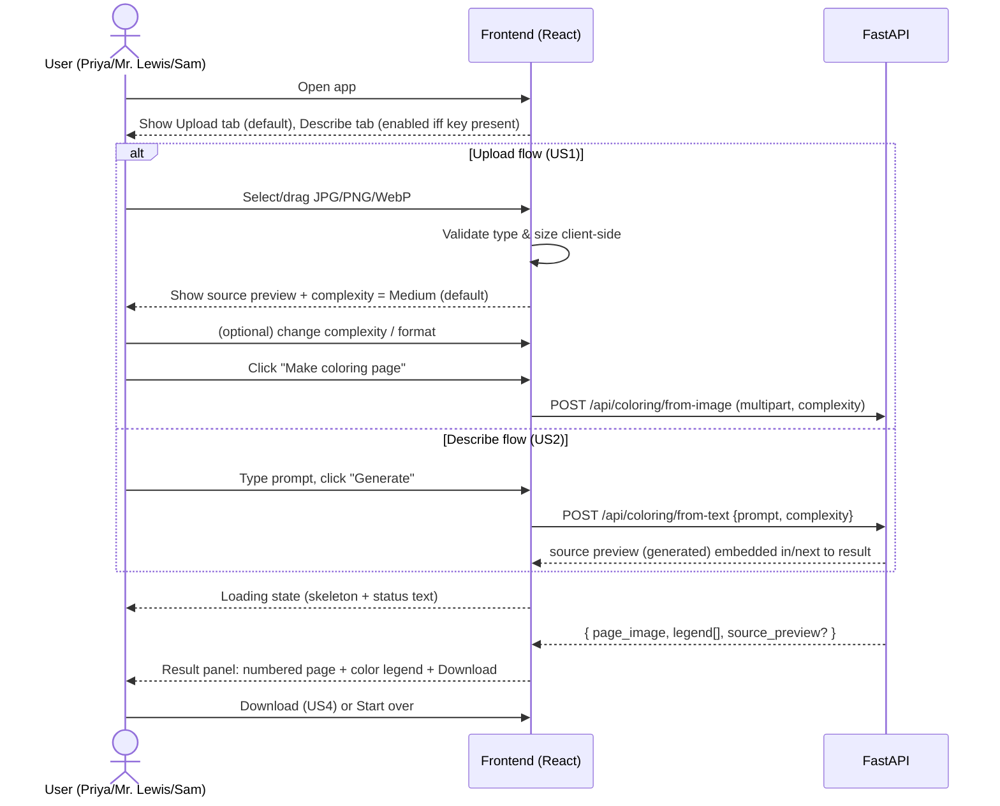
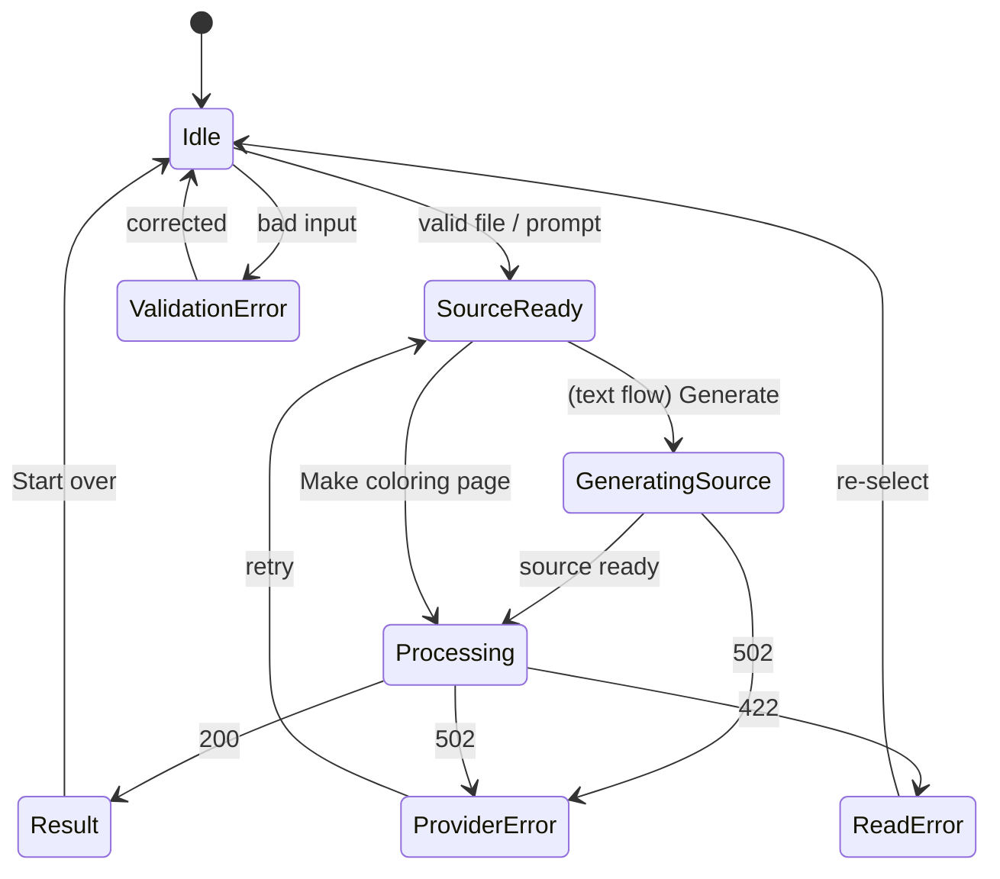

# UI/UX Design — coloring-book

**Status:** Draft (iteration 1)
**Author:** UI/UX Designer (PM pipeline)
**Date:** 2026-05-24
**Source:** docs/PRD.md

---

## 0. Design Brief Recap & Decisions

Per PM directive, follow-up questions are not asked; reasonable decisions are
made and recorded below as **design assumptions (DA)**. These are derived
directly from the PRD (§4 Personas, §5 User Stories, §9 Dependencies).

- **DA1 — Platform:** Responsive web only (PRD §3 non-goal: no native). Desktop
  is the primary breakpoint (parents/teachers printing from a laptop); the layout
  degrades gracefully to a single column on mobile.
- **DA2 — Tone:** Friendly, playful, low-jargon. Primary persona Priya is
  non-technical and wants a printable page "in under a minute." The UI must read
  like a consumer toy, not a pro design tool.
- **DA3 — Primary task:** "Give it a picture or an idea → get a coloring page."
  The entire screen is organized around this single linear flow. Everything else
  (complexity, format) is secondary and tucked into a compact controls strip.
- **DA4 — Brand:** Starting from scratch. We adopt a warm, crayon-box palette
  (see §6) to signal "coloring" instantly and differentiate from sterile AI tools.
- **DA5 — Single-page app, no routing/auth.** No login, no library, no nav bar
  beyond a lightweight header (PRD §3, A1).
- **DA6 — Two input modes are equal-weight peers** presented as tabs: **Upload**
  and **Describe** (PRD FR9). Describe is disabled with an inline explanation when
  no provider key is configured (PRD FR11).

---

## 1. Information Architecture

The app is a **single screen, single primary flow**, with two interchangeable
input sources feeding one shared result panel.



There are no other pages. State lives entirely client-side for one session
(PRD NFR2: API is stateless; nothing persisted).

---

## 2. Primary User Flow (annotated)



Design intent: the user should always know **which of three steps** they are in —
(1) provide input, (2) wait, (3) get result. The layout makes those three states
spatially obvious (input on the left, result on the right on desktop; stacked on
mobile).

---

## 3. Screen Layout — Desktop (≥ 1024px)

ASCII wireframe of the single screen. Two-column working area: **input/controls**
left, **result** right.

```
┌──────────────────────────────────────────────────────────────────────────┐
│  🖍  coloring-book                                  Make a color-by-number  │  Header (64px)
├──────────────────────────────────────────────────────────────────────────┤
│                                                                            │
│  ┌──────────────────────────────┐   ┌───────────────────────────────────┐ │
│  │  [ Upload ]  [ Describe ]     │   │  RESULT                           │ │
│  │  ────────────                 │   │                                   │ │
│  │                               │   │   ┌─────────────────────────────┐ │ │
│  │   ┌───────────────────────┐   │   │   │                             │ │ │
│  │   │   ⬆  Drag image here   │   │   │   │   (numbered B&W outline)    │ │ │
│  │   │   or click to browse  │   │   │   │                             │ │ │
│  │   │   JPG · PNG · WebP     │   │   │   │     [ 1 ] [ 2 ] [ 3 ] ...   │ │ │
│  │   │   up to 10 MB         │   │   │   │                             │ │ │
│  │   └───────────────────────┘   │   │   └─────────────────────────────┘ │ │
│  │                               │   │                                   │ │
│  │   Source preview:             │   │   LEGEND                          │ │
│  │   ┌───────────┐               │   │   ▢1 Red    ▢2 Sky Blue          │ │
│  │   │  (thumb)  │               │   │   ▢3 Yellow ▢4 Green  ▢5 …        │ │
│  │   └───────────┘               │   │                                   │ │
│  │                               │   │   [  ⬇ Download PNG  ]  [ SVG ]   │ │
│  │   Complexity:                 │   │   [  ↺ Start over  ]              │ │
│  │   ( ) Simple (•) Medium ( ) Detailed                                  │ │
│  │                               │   │                                   │ │
│  │   [  Make coloring page  →  ] │   │                                   │ │
│  └──────────────────────────────┘   └───────────────────────────────────┘ │
│                                                                            │
│  Pages are generated on the fly and never stored. Made for printing.       │  Footer
└──────────────────────────────────────────────────────────────────────────┘
```

- **Left column (input):** tab switcher → dropzone/prompt → source preview →
  complexity → primary CTA. Vertical reading order matches task order.
- **Right column (result):** empty/illustrated placeholder until a page exists,
  then the numbered page, legend, and download/reset actions.
- The primary CTA (`Make coloring page`) is the only filled, high-contrast button
  on screen at a time (hierarchy: PRD personas need one obvious next step).

### Describe tab (left column variant)

```
┌──────────────────────────────┐
│  [ Upload ]  [ Describe ]     │
│              ──────────       │
│                               │
│  Describe your picture:       │
│  ┌───────────────────────┐    │
│  │ a friendly dinosaur    │    │
│  │                        │    │
│  └───────────────────────┘    │
│  e.g. "a cat on a roof"       │
│                               │
│  Complexity: ( )S (•)M ( )D    │
│                               │
│  [  ✨ Generate & make page ] │
└──────────────────────────────┘
```

When `OPENAI_API_KEY`/`STABILITY_API_KEY` is absent (PRD FR11), the Describe tab
renders disabled:

```
┌──────────────────────────────┐
│  [ Upload ]  [ Describe 🔒 ]  │
│                               │
│  Text-to-image is turned off  │
│  because no AI provider key   │
│  is configured.               │
│  Upload an image instead →    │
└──────────────────────────────┘
```

---

## 4. Screen Layout — Mobile (< 768px)

Single column; result stacks **below** input. The CTA is sticky-ish at the bottom
of the input block so it's always reachable after choosing a file.

```
┌───────────────────────────┐
│ 🖍 coloring-book           │
├───────────────────────────┤
│ [ Upload ] [ Describe ]    │
│ ─────────                  │
│ ┌───────────────────────┐ │
│ │  ⬆ Tap to add a photo │ │
│ │  JPG·PNG·WebP ≤10MB   │ │
│ └───────────────────────┘ │
│ (source thumb)            │
│ Complexity: S (•M) D       │
│ [ Make coloring page → ]   │
├───────────────────────────┤
│ RESULT                     │
│ ┌───────────────────────┐ │
│ │  numbered outline      │ │
│ └───────────────────────┘ │
│ LEGEND ▢1 Red ▢2 Blue …   │
│ [ ⬇ Download ] [ ↺ ]      │
└───────────────────────────┘
```

Breakpoints (DA1):
- **≥ 1024px:** two columns (input | result), ~ 40% / 60% split.
- **768–1023px:** two columns, 50/50; legend wraps to 2 rows.
- **< 768px:** single column, result below; dropzone full width.

---

## 5. UI States (the loop the user lives in)

Every interactive flow moves through these states. The frontend must render each
explicitly (PRD US5, FR7, FR11, Edge Cases §8).

| State | Trigger | Visual | Notes |
|-------|---------|--------|-------|
| **Idle / empty** | First load, or after "Start over" | Dropzone + illustrated empty result placeholder ("Your coloring page will appear here") | Default complexity = Medium |
| **Source ready** | File selected / prompt valid | Source preview thumbnail; CTA enabled | Client-side validates type+size before enabling CTA |
| **Generating source** | Describe → Generate clicked | Spinner + "Drawing your picture…" | Only in text flow; bounded by provider latency |
| **Processing** | CTA clicked / source generated | Skeleton over result panel + "Making your coloring page…" + progress shimmer | < 10s p95 target (NFR1) |
| **Result** | API 200 | Numbered page, legend, Download + Start over | Source preview remains visible (OQ4 default: show source) |
| **Validation error** | Bad type / oversized / empty prompt (400) | Inline red helper text under input; CTA stays disabled | Never a modal; keep it inline & specific |
| **Processing/read error** | 422 corrupt image | Toast/banner: "We couldn't read that image. Try another." | Offers re-select |
| **Provider error** | 502 generation unavailable | Banner: "Generation service is busy. Try again." + Retry button | Upload flow still works |
| **Key missing** | No provider key | Describe tab disabled w/ explanation (see §3) | Upload unaffected |

State machine:



---

## 6. Visual Design System

### 6.1 Color palette (UI chrome — distinct from the coloring legend palette)

A warm, crayon-box identity. These are **interface** colors, not the color-by-number
legend (which is a separate fixed palette owned by the backend per PRD FR5/FR6).

| Token | Hex | Usage |
|-------|-----|-------|
| `--brand-700` | `#C2410C` | Primary CTA, active tab underline (burnt-crayon orange) |
| `--brand-500` | `#F97316` | Hover, accents |
| `--brand-100` | `#FFEDD5` | CTA-soft backgrounds, selected complexity chip |
| `--ink-900` | `#1C1917` | Primary text, outline preview frame |
| `--ink-600` | `#57534E` | Secondary text, helper copy |
| `--ink-300` | `#D6D3D1` | Borders, dividers, dropzone dashed border |
| `--surface` | `#FFFBF5` | App background (warm paper) |
| `--surface-card` | `#FFFFFF` | Cards / panels |
| `--success` | `#16A34A` | Success ticks |
| `--danger` | `#DC2626` | Validation errors, error banners |
| `--info` | `#2563EB` | Info banners (key-missing notice) |

Rationale (DA4): warm paper + crayon orange instantly says "coloring," and reads
friendly to non-technical Priya. High contrast `ink-900` on `surface` keeps it
accessible.

### 6.2 Typography

| Role | Font | Size / Weight |
|------|------|---------------|
| Display / logo | `Baloo 2` (rounded, playful), fallback `system-ui` | 22px / 700 |
| Headings (RESULT, LEGEND) | `system-ui` | 14px / 700, letter-spacing 0.06em, uppercase |
| Body / labels | `system-ui` | 15px / 400–500 |
| Helper / fine print | `system-ui` | 13px / 400, `--ink-600` |

One rounded display face for personality; everything else system-ui for speed and
legibility. No web-font blocking on the critical path (logo can fall back).

### 6.3 Spacing & shape

- 8px spacing grid (4 / 8 / 16 / 24 / 32).
- Card radius 16px; buttons 12px; dropzone 20px with 2px dashed `--ink-300`.
- Soft shadow on cards: `0 1px 3px rgba(28,25,23,.08), 0 8px 24px rgba(28,25,23,.06)`.

### 6.4 Iconography

Minimal, line-style icons: upload arrow (⬆), sparkles (✨, Describe), download (⬇),
reset (↺), lock (🔒 for disabled Describe). Emoji acceptable as MVP placeholders;
swap for an icon set later.

---

## 7. Component Specs

| Component | Purpose | Key props / states |
|-----------|---------|--------------------|
| `AppHeader` | Logo + one-line tagline | static |
| `ModeTabs` | Switch Upload / Describe | `active`, `describeEnabled`, `onChange` |
| `Dropzone` | File select via click or drag | `accept` (jpg/png/webp), `maxSizeMB=10`, `onSelect`, `error`, `disabled` |
| `PromptInput` | Multiline prompt + char hint | `value`, `onChange`, `disabled`, `placeholder` |
| `SourcePreview` | Thumbnail of uploaded/generated image | `src`, `loading` |
| `ComplexityPicker` | Simple/Medium/Detailed segmented control | `value` (default `medium`), `onChange` |
| `FormatToggle` | PNG (default) / SVG | shown only if `OUTPUT_FORMAT` allows SVG; else hidden |
| `PrimaryCTA` | "Make coloring page" / "Generate & make page" | `loading`, `disabled`, `label` |
| `ResultPanel` | Empty placeholder → page + legend + actions | `state` (idle/processing/result/error) |
| `Legend` | Number→color swatches | `entries: [{n, name, hex}]`, wraps responsively |
| `DownloadButton` | Download rendered page | `href`/`blob`, `format` |
| `Banner` / `Toast` | Errors & info | `variant` (danger/info/success), `message`, `action?` |
| `LoadingSkeleton` | Processing shimmer over result | `label` |

### Complexity picker detail

```
Complexity:  ┌────────┐┌────────┐┌──────────┐
             │ Simple ││ Medium ││ Detailed │
             └────────┘└━━━━━━━━┘└──────────┘
                ~6        ~12        ~20        ← region/color count hint (subtle)
```

Selected chip uses `--brand-100` fill + `--brand-700` border. The faint count hint
(`~6 / ~12 / ~20`, PRD FR6/A6) teaches Sam (hobbyist) what the levels mean without
exposing internals.

### Legend detail

Each entry: a filled swatch in the legend's assigned color, the number, and the
color name (PRD FR5, OQ1 default named-color set; "Color N" fallback beyond the
named set). Swatches wrap to multiple rows on narrow screens.

```
LEGEND
▮ 1  Red      ▮ 2  Sky Blue   ▮ 3  Yellow
▮ 4  Green    ▮ 5  Purple     ▮ 6  Brown
```

---

## 8. Interaction & Micro-detail Notes

- **Default complexity is Medium** (PRD A6) and pre-selected so the impatient
  parent can go file → CTA → done with zero extra choices.
- **Drag-and-drop and click both work** on the dropzone; the whole card is a drop
  target with a highlighted border on dragover.
- **Client-side validation first** (type + size) so obvious mistakes never hit the
  network; server still re-validates (PRD FR7, NFR3). Error copy is specific:
  "That file is 14 MB — the max is 10 MB."
- **Source preview stays visible** alongside the result (OQ4 default) so users
  trust that the page came from their input.
- **Download is primary in the result state**; "Start over" is a quiet secondary
  (text/link button) to avoid accidental resets.
- **No layout shift on success:** the result panel reserves its space from the
  start (illustrated placeholder), so the page doesn't jump when the image lands.
- **Loading copy is human:** "Making your coloring page…" not "Processing request."
- **Print-friendliness cue:** footer line "Made for printing" and the result image
  is rendered at the page aspect (PRD FR4, R6) so what you see is what prints.

---

## 9. Accessibility

- Color is never the sole signal: legend pairs every swatch with a **number + name**,
  and the printable output is inherently B&W with numbers (color-blind safe by design).
- All interactive elements keyboard-reachable; visible focus ring in `--brand-500`.
- Dropzone has an equivalent `<input type=file>` for screen readers + keyboard.
- Contrast: body text `--ink-900` on `--surface` ≥ 7:1; CTA text white on
  `--brand-700` ≥ 4.5:1.
- Loading and error states announced via `aria-live="polite"` regions.
- Alt text: source preview = "Your uploaded/generated image"; result =
  "Your color-by-number page".

---

## 10. HTML/CSS Mockup (browser-previewable)

A static, self-contained mockup of the desktop result state. Drop into any
`.html` file to preview the look-and-feel; it is a design reference, not the
production React component.

```html
<!doctype html>
<html lang="en">
<head>
<meta charset="utf-8" />
<meta name="viewport" content="width=device-width, initial-scale=1" />
<title>coloring-book — design mock</title>
<style>
  :root{
    --brand-700:#C2410C; --brand-500:#F97316; --brand-100:#FFEDD5;
    --ink-900:#1C1917; --ink-600:#57534E; --ink-300:#D6D3D1;
    --surface:#FFFBF5; --surface-card:#FFFFFF; --danger:#DC2626; --info:#2563EB;
  }
  *{box-sizing:border-box} body{margin:0;font:15px/1.5 system-ui,sans-serif;
    color:var(--ink-900);background:var(--surface)}
  header{display:flex;align-items:center;justify-content:space-between;
    padding:16px 24px;border-bottom:1px solid var(--ink-300);background:var(--surface-card)}
  .logo{font:700 22px "Baloo 2",system-ui}
  .tag{color:var(--ink-600);font-size:13px}
  main{max-width:1100px;margin:24px auto;padding:0 24px;
    display:grid;grid-template-columns:40% 60%;gap:24px}
  .card{background:var(--surface-card);border:1px solid var(--ink-300);
    border-radius:16px;padding:20px;
    box-shadow:0 1px 3px rgba(28,25,23,.08),0 8px 24px rgba(28,25,23,.06)}
  .tabs{display:flex;gap:8px;margin-bottom:16px}
  .tab{padding:8px 16px;border-radius:12px;border:1px solid var(--ink-300);
    background:#fff;cursor:pointer}
  .tab.active{border-color:var(--brand-700);color:var(--brand-700);
    background:var(--brand-100);font-weight:600}
  .dropzone{border:2px dashed var(--ink-300);border-radius:20px;padding:32px;
    text-align:center;color:var(--ink-600)}
  .chips{display:flex;gap:8px;margin:16px 0}
  .chip{flex:1;text-align:center;padding:10px;border-radius:12px;
    border:1px solid var(--ink-300);background:#fff;cursor:pointer}
  .chip.sel{background:var(--brand-100);border-color:var(--brand-700);
    color:var(--brand-700);font-weight:600}
  .chip small{display:block;color:var(--ink-600);font-weight:400}
  .cta{width:100%;padding:14px;border:0;border-radius:12px;cursor:pointer;
    background:var(--brand-700);color:#fff;font-weight:700;font-size:16px}
  h3{font-size:14px;letter-spacing:.06em;text-transform:uppercase;color:var(--ink-600)}
  .page{aspect-ratio:8.5/11;border:1px solid var(--ink-300);border-radius:12px;
    display:flex;align-items:center;justify-content:center;color:var(--ink-300);
    background:repeating-linear-gradient(45deg,#fff,#fff 18px,#fafafa 18px,#fafafa 36px)}
  .legend{display:flex;flex-wrap:wrap;gap:10px;margin:12px 0}
  .li{display:flex;align-items:center;gap:6px;font-size:13px}
  .sw{width:16px;height:16px;border-radius:4px;border:1px solid var(--ink-300)}
  .actions{display:flex;gap:8px;margin-top:8px}
  .ghost{background:#fff;border:1px solid var(--ink-300);border-radius:12px;
    padding:12px 16px;cursor:pointer}
  footer{max-width:1100px;margin:8px auto 32px;padding:0 24px;color:var(--ink-600);
    font-size:13px}
</style>
</head>
<body>
  <header>
    <div class="logo">🖍 coloring-book</div>
    <div class="tag">Make a color-by-number page from a photo or an idea</div>
  </header>
  <main>
    <section class="card">
      <div class="tabs">
        <div class="tab active">Upload</div>
        <div class="tab">Describe ✨</div>
      </div>
      <div class="dropzone">⬆ Drag an image here, or click to browse<br>
        <small>JPG · PNG · WebP — up to 10&nbsp;MB</small></div>
      <div class="chips">
        <div class="chip">Simple<small>~6</small></div>
        <div class="chip sel">Medium<small>~12</small></div>
        <div class="chip">Detailed<small>~20</small></div>
      </div>
      <button class="cta">Make coloring page →</button>
    </section>
    <section class="card">
      <h3>Result</h3>
      <div class="page">Your numbered coloring page</div>
      <h3 style="margin-top:16px">Legend</h3>
      <div class="legend">
        <span class="li"><span class="sw" style="background:#e11d48"></span>1 Red</span>
        <span class="li"><span class="sw" style="background:#38bdf8"></span>2 Sky Blue</span>
        <span class="li"><span class="sw" style="background:#facc15"></span>3 Yellow</span>
        <span class="li"><span class="sw" style="background:#22c55e"></span>4 Green</span>
        <span class="li"><span class="sw" style="background:#a855f7"></span>5 Purple</span>
        <span class="li"><span class="sw" style="background:#92400e"></span>6 Brown</span>
      </div>
      <div class="actions">
        <button class="cta" style="flex:1">⬇ Download PNG</button>
        <button class="ghost">SVG</button>
        <button class="ghost">↺ Start over</button>
      </div>
    </section>
  </main>
  <footer>Pages are generated on the fly and never stored. Made for printing.</footer>
</body>
</html>
```

---

## 11. Mapping Design → PRD Requirements

| PRD item | Where addressed in this design |
|----------|--------------------------------|
| US1 Upload | §3 left column, §5 states, §7 Dropzone/SourcePreview |
| US2 Describe | §3 Describe variant, §2 sequence (GeneratingSource), §5 |
| US3 Complexity | §7 ComplexityPicker, §8 defaults |
| US4 Download | §3 result panel, §7 DownloadButton/Legend |
| US5 Progress/errors | §5 UI states + state machine, §7 Banner/Toast/Skeleton |
| FR4 Output formats | §7 FormatToggle (PNG default, SVG when configured) |
| FR5 Legend | §7 Legend spec, §10 mockup |
| FR6 Complexity presets | §7 picker with ~6/~12/~20 hints |
| FR9 Two modes | §3 ModeTabs |
| FR11 Graceful degradation | §3 disabled Describe tab, §5 Key-missing state |
| NFR1 Performance | §5 Processing state <10s target, §8 no-layout-shift |
| NFR3 Security | §8 client-side validation (server re-validates), no keys in UI |
| Accessibility | §9 |

---

## 12. Out of Scope (this design)

Mirrors PRD §3 non-goals: no in-browser coloring canvas, no accounts/library, no
sharing links, no print-shop flow, no per-region source-color extraction UI. These
are explicitly deferred so the MVP screen stays a single, obvious flow.
